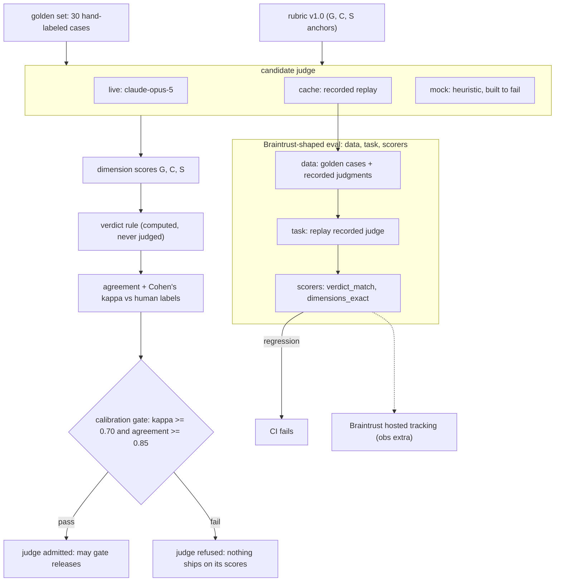

# kappa-gate

[](https://github.com/jbisaccia-9/kappa-gate/actions) · [captured results](RESULTS.md)

**An LLM-as-judge evaluation harness where the judge itself must pass a gate.**

Most eval pipelines trust their judge implicitly: a model grades outputs, the
scores gate a release, and nobody asks whether the grader can grade. This repo
inverts that. A candidate judge is admitted only after demonstrating agreement
with hand-authored reference labels — measured with Cohen's κ, which corrects
for chance agreement — against a versioned rubric. Until the judge clears the
calibration gate, nothing downstream ships on its say-so.

The inter-rater methodology comes from classroom assessment design (rubric
anchors, blind reference labeling, agreement statistics), applied to LLM
evaluation — where it turns out to fit exactly.

## How it works

```
data/golden_set.jsonl     30 synthetic support cases, hand-labeled against RUBRIC.md
        │                 (fictional solar company; 10 failure modes incl. hallucinated
        │                  numbers, unit errors, over-refusal, safety, out-of-scope)
        ▼
python -m kappagate run   the candidate judge scores every case (G/C/S, 0–2)
        │                 verdicts are COMPUTED from scores — never judged directly
        ▼
results/report.json       verdict κ, per-dimension weighted κ, per-failure-mode
        │                 agreement, every disagreement listed by id
        ▼
python -m kappagate gate  exit 0 only if κ ≥ 0.70 AND agreement ≥ 0.85
```

Three judge modes:

| mode | what it is | needs network |
|---|---|---|
| `live` | Claude via the Anthropic API (`--record` caches judgments) | yes |
| `cache` | deterministic replay of a recorded live run | no |
| `mock` | a deliberately naive heuristic that **exists to fail the gate** | no |

The mock judge is the demo of the thesis: it reaches ~respectable raw agreement
by exploiting surface features, and the κ gate correctly refuses it anyway.
High accuracy with chance-level κ is exactly the degenerate judge this repo is
built to catch (see `tests/test_gate.py::test_gate_fails_on_kappa_alone`).

## The flow



## Eval structure (Braintrust-shaped)

`python -m kappagate suite` runs the `Eval(data, task, scores)` contract
keyless: data is the golden set joined with the recorded judge run, the task
replays those judgments, and the scorers (`verdict_match`,
`dimensions_exact`) fail CI on regression. With `pip install ".[obs]"` and
`BRAINTRUST_API_KEY`, `push_braintrust()` hands the identical suite to hosted
Braintrust.

## Quickstart

```
python -m venv .venv
.venv/bin/pip install -U pip           # stock macOS pip is too old for editable installs
.venv/bin/pip install -e ".[dev]"
.venv/bin/python -m pytest -q          # unit tests, no network
.venv/bin/python -m kappagate run      # mock mode, end to end, no network
.venv/bin/python -m kappagate gate     # watch the mock judge get refused

# with ANTHROPIC_API_KEY in your environment:
.venv/bin/python -m kappagate run --mode live --record
.venv/bin/python -m kappagate gate
```

## Calibration results

| judge | verdict κ | agreement | gate |
|---|---|---|---|
| heuristic mock | 0.61 | 80% | **refused** (κ < 0.70, by design) |
| claude-opus-5 | 1.00 | 100% (30/30) | **passed** |

Recorded run committed to `cache/judgments.jsonl` — replay it with
`python -m kappagate run --mode cache`. Per-dimension weighted κ for the live
judge: G 1.00, S 0.57, C 0.20. The verdicts are unanimous, but the dimension
spread is the honest finding: the judge reaches the same conclusions while
scoring Completeness differently case-by-case — the C anchors are the rubric's
weakest point and first on the roadmap. A perfect verdict score on a 30-case
v1 set also says the set has headroom: harder boundary cases are the second
roadmap item.

## Design decisions

- **Verdicts are derived, not judged.** The pass/fail rule is a deterministic
  function of dimension scores (RUBRIC.md), so the judge argues about
  observable dimensions, never the conclusion.
- **κ over accuracy.** A judge that predicts the majority class scores high
  accuracy and near-zero κ. The gate requires both.
- **Thresholds are config, not code.** Changing the bar is a reviewed,
  versioned event (`eval_config.json`).
- **Rubric edits invalidate labels.** Any rubric change bumps its version;
  reference labels are only valid for the version they were authored against.
- **Everything here is synthetic.** The company, policies, queries, and answers
  are invented for this dataset. No production data, no real customer text.

MIT license.
